# PIZZOZO ANNUAL SALES REPORT DASHBOARD 

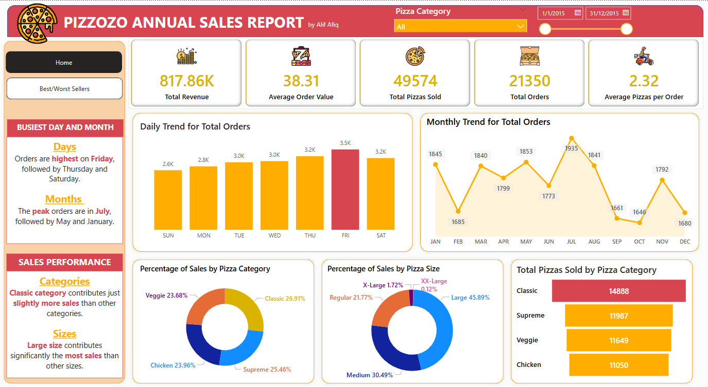


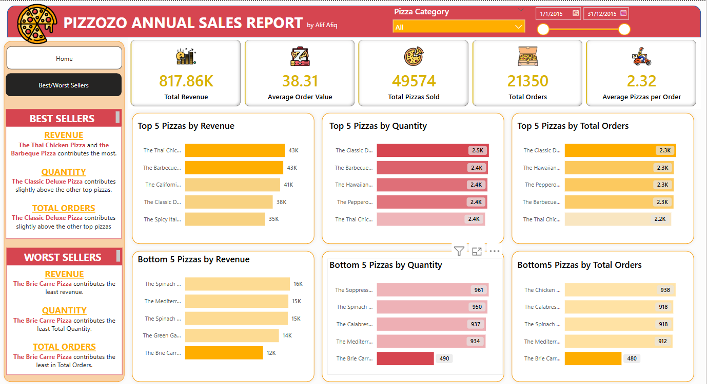

## PURPOSE
To create a dashboard which includes the relevant data to give insight into the business performance on revenue, orders, sales from pizza categories and sizes. It requires the data analyst to transform a raw table in a csv file into an interactive dashboard showing the performance metric in a comprehensive way. This case study includes the data validation using SQL, data cleaning and visualisation using Power BI involving power query and DAX function.

## USER REQUIREMENT 

The users wish to see clear insight regarding revenue and sales trends from the raw data which contains thousands rows. They need the data analyst to pull the required insight out of the tables and put those necessary data in forms of KPI and charts on a dashboard. 

### KPI's REQUIREMENT

We need to analyze key indicators for our pizza sales data to gain insights into our business performance. Specifically, we want to calculate the following metrics:

Total Revenue: The sum of the total price of all pizza orders.

Average Order Value: The average amount spent per order, calculated by dividing the total revenue by the total number of orders.

Total Pizzas Sold: The sum of the quantities of all pizzas sold.

Total Orders: The total number of orders placed.

Average Pizzas Per Order: The average number of pizzas sold per order, calculated by dividing the total number of pizzas sold by the total number of orders.


### CHARTS REQUIREMENT

We would like to visualize various aspects of our pizza sales data to gain insights and understand key
trends. We have identified the following requirements for creating charts:

Daily Trend for Total Orders: 

Create a bar chart that displays the daily trend of total orders over a specific time period. This chart will help us identify any patterns or fluctuations in order volumes on a daily basis.


Monthly Trend for Total Orders: 

Create a line chart that illustrates the hourly trend of total orders throughout the dav. This chart will allow us to identify peak hours or periods of high order activity.


Percentage of Sales by Pizza Category: 

Create a pie chart that shows the distribution of sales across different pizza categories. This chart will provide insights into the popularity of various pizza categories and their contribution to overall sales.


Percentage of Sales by Pizza Size:

Generate a pie chart that represents the percentage of sales attributed to different pizza sizes. This chart will help us understand customer preferences for pizza sizes and their impact on sales.


Total Pizzas Sold by Pizza Category: 

Create a funnel chart that presents the total number of pizzas sold for each pizza category. This chart will allow us to compare the sales performance of different pizza categories.


Top 5 Best Sellers by Revenue, Total Quantity and Total Orders: 

Create a bar chart highlighting the top 5 best-selling pizzas based on the Revenue, Total Quantity, Total Orders. This chart will help us identify the most popular pizza options.


Bottom 5 Best Sellers by Revenue, Total Quantity and Total Orders: 

Create a bar chart showcasing the bottom 5 worst-selling pizzas based on the Revenue, Total Quantity, Total Orders. This chart will enable us to identify underperforming or less popular pizza options.


## WORK SCOPES

Data Validation and Cleaning:  
Data validation is run on SQL to be used fro double-checking the result in the dashboard. The query will be recorded. 
Remove any irrelevant information and altering tables on Power BI.

Dashboard:
Structuring and combining the KPI and Charts in a dashboard.

Final Report:
Showcasing the formal documentation and flow.


## DELIVERABLES

SQL Query Doc: Contain all the query used in SQL to manipulate data and pull insight which can be used for double-checking with the result of dashboard.

Dashboard: Equipped with the required  KPI and Charts

Report: Showcasing the formal documentation and flow.


## WORKFLOW BRIEFING 

This work includes data validation using SQL, data cleaning and visualisation using Power BI. Data validation is run on SQL to gain a number of each required metrics which will be used to double-check with the result in Power BI. 

The data cleaning includes altering the tables by adding columns for necessary input (which is not available in the origin table) and for suitable name/preference/alias (for example January as Jan, 1/1/2015 as Monday). The process in Power BI includes power query and DAX function.

The visualisation is done using Power BI. The dashboard is equipped with KPI metrics and various charts containing relevant insight about pizza revenue trend, sales trend, order trend, and sales trend regarding the pizza category and size.


### SQL Queries

#### KPI requirement


Total revenue = sum of total price
```sql
select sum(total_price) as 'Total Revenue' from pizza_sales
```


Average order value = total revenue / total order
```sql
select sum(total_price)/count(distinct order_id) as 'Average Order Value' from pizza_sales
```

Total pizza sold
```sql
select sum(quantity) as 'Total Pizza Sold' from pizza_sales
```

Total orders
```sql
select count(distinct order_id) as 'Total Orders' from pizza_sales
```

Average pizza per order = total pizza / total order
```sql
select cast 
(cast (sum(quantity) as decimal (10,2))
/ cast (count(distinct order_id) as decimal (10,2)) as decimal (10,2))
as 'Average Pizzas per Order' from pizza_sales
```


#### Chart requirement 

Trend for total order (daily) as bar chart
```sql
select datename(DW, order_date) as 'Order Day',
count(distinct order_id) as 'Total Orders' 
from pizza_sales
group by datename(DW, order_date)
```


Trend for order (monthly) as line chart
```sql
select datename(MONTH, order_date) as 'Month Name',
count(distinct order_id) as 'Total Orders' 
from pizza_sales
group by datename(Month, order_date)
order by 'Total Orders' Desc
```

Percentage of sales by pizza category (pie chart) 
```sql
select pizza_category,sum(total_price)*100 / (select sum(total_price) from pizza_sales) as 'Percentage of Total Sales'
from pizza_sales
group by pizza_category
```


If with total sales per pizza category, it will look like this:
```sql
select pizza_category, sum(total_price) as 'Total Sales', sum(total_price)*100 / (select sum(total_price) from pizza_sales) as 'Percentage of Total Sales'
from pizza_sales
group by pizza_category
```


If we want a specific month, it will look like this:
```sql
select pizza_category, 
sum(total_price) as 'Total Sales', 
sum(total_price)*100 / (select sum(total_price) from pizza_sales where month(order_date) = 1) as 'Percentage of Total Sales'
from pizza_sales
where month(order_date) = 1
group by pizza_category
```

Percentage of pizza sales by size (pie chart) 
```sql
select pizza_size, 
cast(sum(total_price) as decimal (10,2)) as 'Total Sales', 
cast(sum(total_price)*100 / (select sum(total_price) from pizza_sales) as decimal (10,2)) as 'Percentage of Total Sales'
from pizza_sales
group by pizza_size
order by 'Percentage of Total Sales' DESC
```

If we want to see the particular month, it will look like this:
```sql
select pizza_size, 
cast(sum(total_price) as decimal (10,2)) as 'Total Sales', 
cast(sum(total_price)*100 / (select sum(total_price) from pizza_sales where datepart (quarter, order_date) = 1) as decimal (10,2)) as 'Percentage of Total Sales'
from pizza_sales
where datepart (quarter, order_date) = 1
group by pizza_size
order by 'Percentage of Total Sales' DESC
```

Total pizza sold by pizza category funnel chart
Top 5 best seller by revenue, total orders, total quantity as in bar chart

Top 5 revenue:
```sql
select top 5 pizza_name, sum(total_price) as 'Total Revenue' from pizza_sales
group by pizza_name 
order by 'Total Revenue' desc
```


Top 5 quantity:
```sql
select top 5 pizza_name, sum(quantity) as 'Total Quantity' from pizza_sales
group by pizza_name 
order by 'Total Quantity' desc
```


Top 5 orders:
```sql
select top 5 pizza_name, count(distinct order_id) as 'Total Orders' from pizza_sales
group by pizza_name 
order by 'Total Orders' desc
```


Bottom 5 worst seller by revenue, total orders, total quantity bar chart

Bottom 5 revenue
```sql
select top 5 pizza_name, sum(total_price) as 'Total Revenue' from pizza_sales
group by pizza_name 
order by 'Total Revenue' 
```

Bottom 5 quantity:
```sql
select top 5 pizza_name, sum(quantity) as 'Total Quantity' from pizza_sales
group by pizza_name 
order by 'Total Quantity' 
```

Bottom 5 orders:
```sql
select top 5 pizza_name, count(distinct order_id) as 'Total Orders' from pizza_sales
group by pizza_name 
order by 'Total Orders' 
```

### Power BI DAX Formula
To create more measures

To create Total Orders 
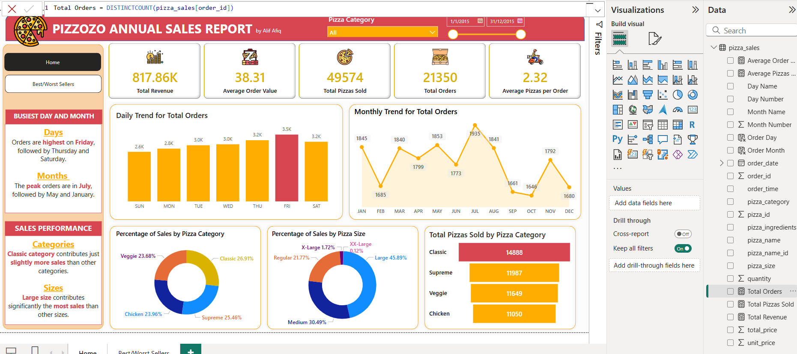


To create Total Pizzas Sold 


To create Total Revenue
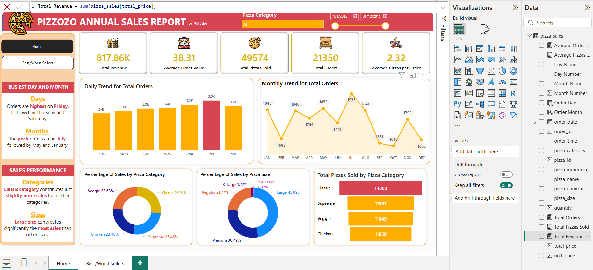


to create Average Order Value
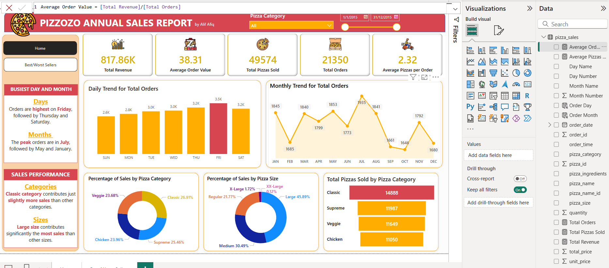


### Power BI Power Query
To manipulate table such as add column and replace value


Add column of shortened day name such as Monday to Mon, 
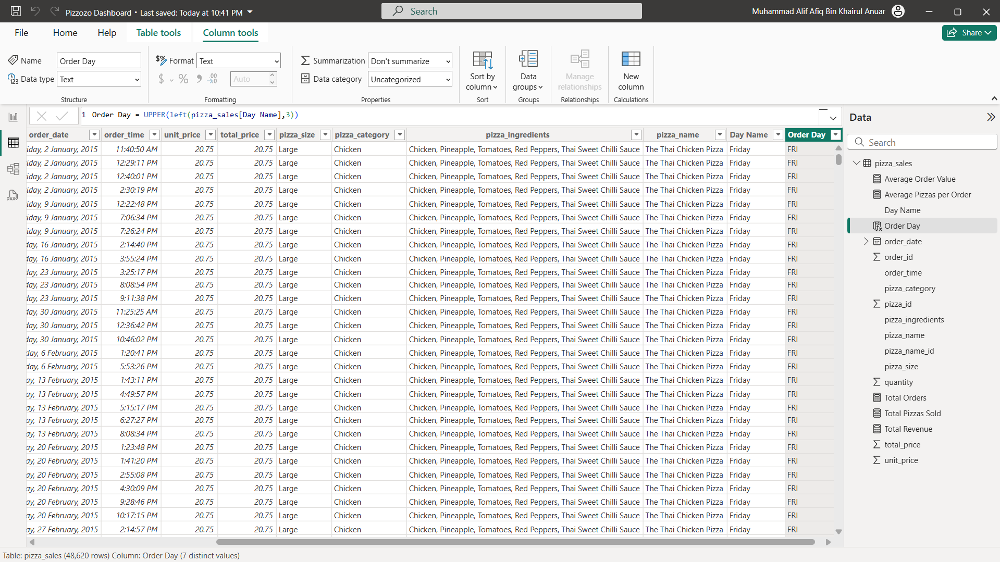


Replace the size shortened size label to longer such as L to Large, 
![longer size label](assets/image power query/Screenshot 2025-02-27 152508.png


Adding column for day number such as Sunday as 1, Monday as 2,
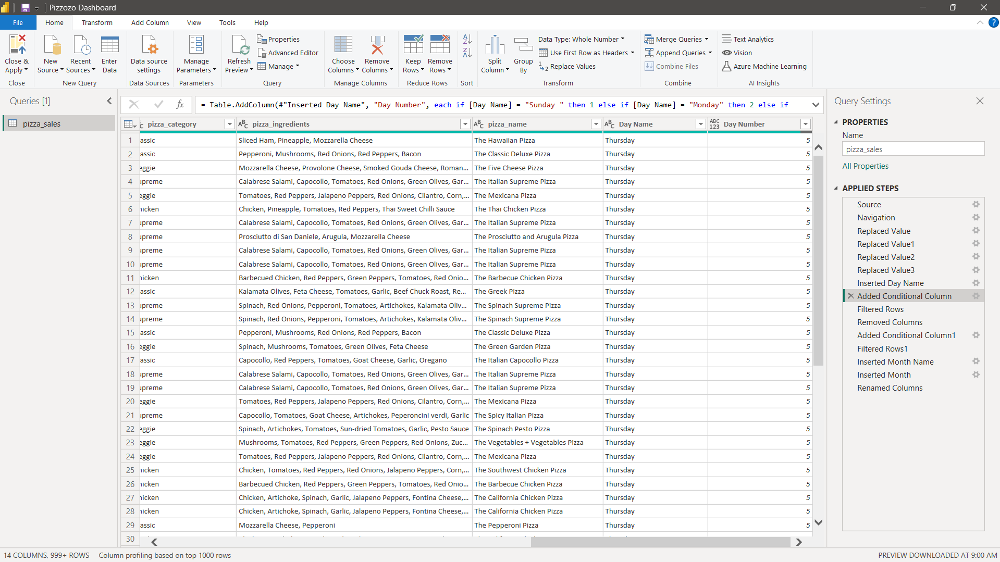


Adding column for month name derived from dates such as 1/1 to 31/1 as January, 
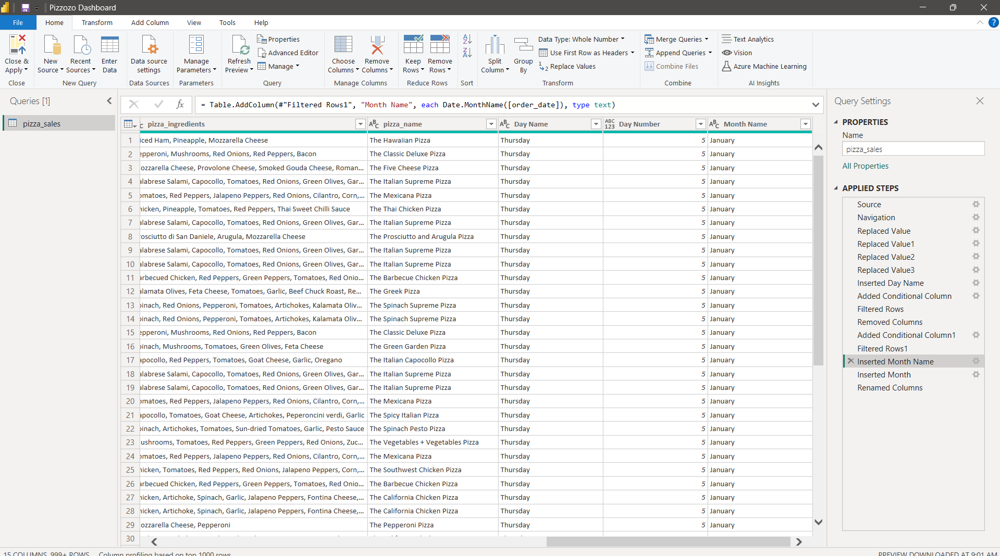


Adding column for month number such as January as 1,
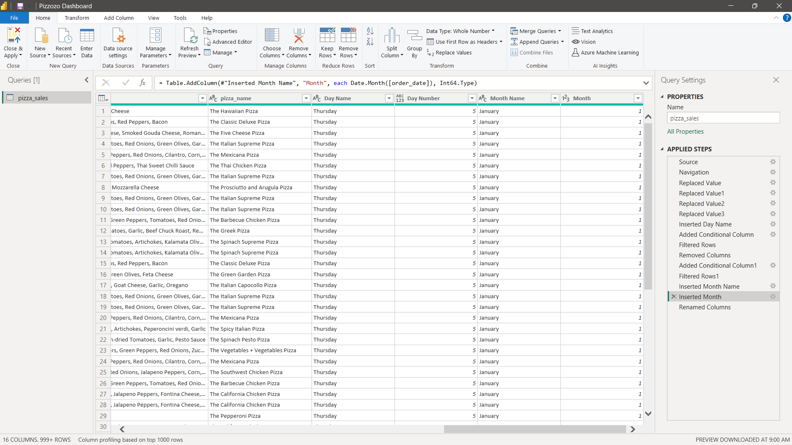

### Power BI Visualisation 

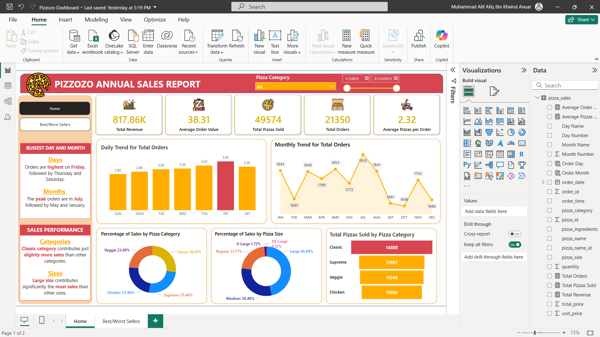


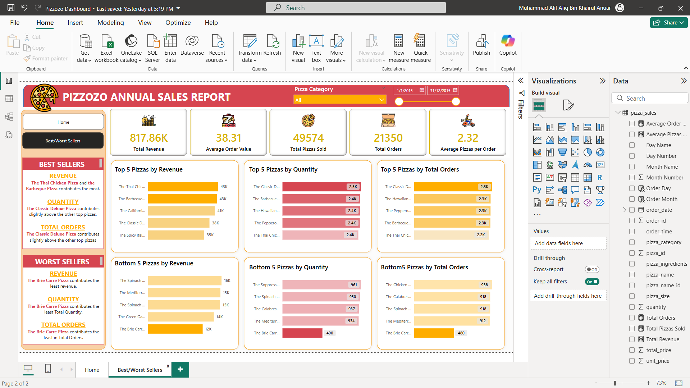

